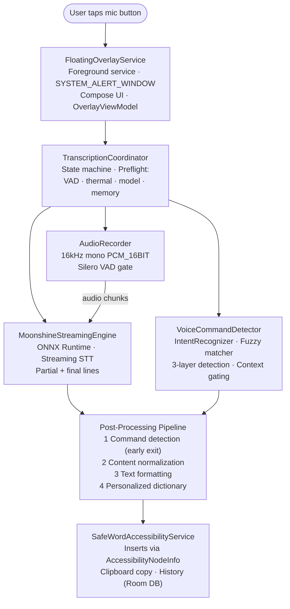
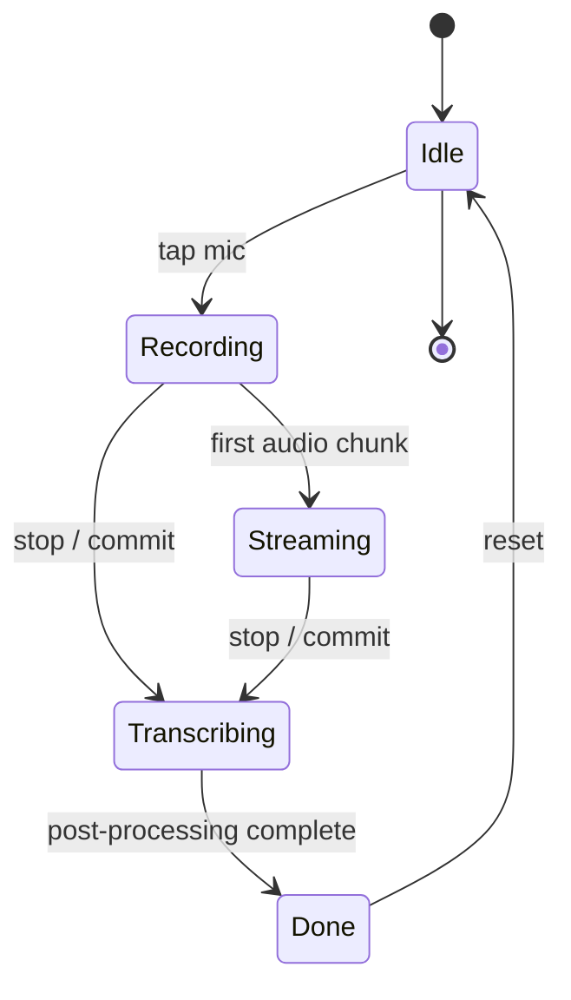

<table align="center"><tr><td width="138" align="right">

<br/>

</td></tr></table>

### On-Device Voice-to-Text Overlay for Android

<p align="center">
[](https://www.android.com)
[](https://kotlinlang.org)
[](https://developer.android.com/jetpack/compose)
[](https://developer.android.com/about/versions)
[](https://developer.android.com/about/versions)
[](LICENSE)
</p>

<p align="center">
  <strong>100% on-device speech-to-text.</strong> No cloud. No recordings sent to servers.<br/>
  Streaming transcription with a floating overlay, voice commands, semantic understanding,<br/>
  and a self-learning personalized dictionary — all running locally on your phone.
</p>

---

## Table of Contents

- [Overview](#overview)
- [Quick Start](#quick-start)
- [Key Features](#key-features)
- [How It Works](#how-it-works)
- [Architecture](#architecture)
- [Tech Stack](#tech-stack)
- [Project Structure](#project-structure)
- [Getting Started](#getting-started)
- [Building](#building)
- [Testing](#testing)
- [Voice Commands](#voice-commands)
- [Configuration](#configuration)
- [Privacy & Security](#privacy--security)
- [Performance](#performance)
- [Contributing](#contributing)
- [License](#license)

---

## Overview

**Safe Word** is a privacy-first Android voice-to-text application that provides real-time, on-device speech transcription via a system-wide floating overlay. Unlike cloud-based dictation services, Safe Word processes all audio locally using the [Moonshine Voice SDK](https://moonshine.ai) — no speech data ever leaves your device.

The app integrates with Android's Accessibility framework to insert transcribed text directly into any text field, in any app. A comprehensive voice command system lets you edit, format, navigate, and control your dictation entirely hands-free.

### Why Safe Word?

| Problem | Solution |
|---------|----------|
| Cloud STT services transmit your voice to remote servers | 100% on-device inference via Moonshine streaming model |
| Switching between keyboard and voice is disruptive | System-wide floating overlay — tap mic, dictate, done |
| ASR errors require manual keyboard correction | Self-learning dictionary auto-learns from your draft edits |
| Voice commands are rigid and limited | 3-layer semantic understanding with natural-language variations |
| Accessibility tools lack voice-only operation | Fully hands-free with context-aware command gating |

---

## Quick Start

Get Safe Word running on a physical device (arm64-v8a, Android 13+) in three steps:

```bash
# 1. Build and install the debug APK
.\gradlew.bat installDebug

# 2. Grant permissions on-device (guided by the onboarding screen):
#    - Microphone       (runtime dialog)
#    - Display over other apps  (Settings → overlay permission)
#    - Accessibility     (Settings → Accessibility → Safe Word)

# 3. Launch the app and download the Moonshine model (~160MB) when prompted
```

Then tap the floating mic button in any app with a text field and start dictating. See [Getting Started](#getting-started) for the full setup walkthrough.

---

## Key Features

### Core Dictation

- **Streaming transcription** — Live text appears as you speak, not after you stop
- **Editable draft transcript** — Review and correct text in the overlay before committing
- **Floating overlay** — System-wide mic button that works across all apps
- **Accessibility integration** — Direct text insertion into any focused field via Android Accessibility Service
- **Foreground microphone service** — Background recording with persistent notification

### Voice Commands (150+ phrases)

- **Deletion** — `delete that`, `delete last word`, `delete last sentence`, `backspace`, `delete [word]`
- **Undo & Redo** — `undo`, `scratch that`, `redo`, `restore that`
- **Selection** — `select all`, `select last word`, `select [word]`, `select to end`
- **Clipboard** — `copy`, `cut`, `paste`, `copy [word]`
- **Replace & Switch** — `replace [X] with [Y]`, `change [X] to [Y]`, `swap [X] and [Y]`
- **Search** — `search for [query]`, `look up [query]`, `google [query]`
- **Navigation** — `new line`, `new paragraph`, `move to end`, `go to start of line`
- **Formatting** — `capitalize that`, `uppercase that`, `bold`, `italic`, `underline`
- **Session control** — `stop listening`, `send`, `submit`, `clear`, `dismiss`
- **Spelling mode** — `spell h e l l o` with NATO phonetic alphabet support
- **Spoken emoji** — 100+ emoji via `[name] emoji` format (e.g., `thumbs up emoji` → 👍)
- **Spoken punctuation** — 40+ punctuation marks and symbols
- **Number conversion** — Spoken numbers → digits, ordinals, currency, percentages, fractions
- **Custom commands** — User-defined trigger phrases with configurable actions

### Intelligence

- **3-layer command detection** — Exact match → Semantic intent recognition → Levenshtein fuzzy
- **Natural language understanding** — `"remove everything"` → ClearAll, `"take that back"` → Undo
- **ASR-tolerant matching** — Handles mis-transcribed verbs (`place` → `replace`, `swat` → `swap`)
- **Context-aware gating** — Password fields suppress commands; search bars restrict formatting
- **Confidence thresholds** — Standard ≥45%, destructive ≥65%
- **Multi-line command joining** — Fragments split across lines are auto-joined

### Personalization

- **Self-learning dictionary** — Draft edits are automatically learned as substitution rules
- **Personalized entries** — Manual from→to phrase mappings with enable/disable toggles
- **Use-count tracking** — Frequently used corrections are prioritized
- **Case-preserving substitution** — Matches original case pattern when applying corrections

### Post-Processing Pipeline

- **Disfluency removal** — Strips filler words, stutters, and false starts
- **Punctuation prediction** — Adds missing periods, commas, and capitalization
- **Confusion set correction** — Fixes common ASR confusions (e.g., `to`/`too`/`two`)
- **Content normalization** — Converts spoken numbers, emoji, and punctuation to symbols
- **Text formatting** — Capitalizes sentence starts, adds trailing punctuation

---

## How It Works



---

## Architecture

Safe Word follows a **service-centric architecture** — the `FloatingOverlayService` owns the UI state and coordinates with the `TranscriptionCoordinator` singleton, rather than using a traditional Activity/ViewModel/Screen pattern.

### Design Principles

- **Service as UI owner** — The floating overlay service manages Compose UI state directly via `OverlayViewModel`
- **Singleton coordinator** — `TranscriptionCoordinator` is a Hilt `@Singleton` that manages the transcription state machine
- **Streaming-first** — Audio is fed to Moonshine in 32ms chunks; partial results update the draft in real time
- **Single commit** — Text is inserted into the target app only when the user stops, not line-by-line
- **Pipeline separation** — Command detection (Phase 1) runs before content normalization (Phase 2-4) for early exit

### Key Components

| Component | Role |
|-----------|------|
| `FloatingOverlayService` | Foreground service hosting the system overlay (mic button + draft text) |
| `OverlayMicButton` | Compose composable with state-driven UI (idle, recording, streaming, transcribing) |
| `OverlayViewModel` | Bridges service state to Compose UI; exposes `draftText` and recording state |
| `TranscriptionCoordinator` | State machine + pipeline orchestrator; coordinates audio, STT, commands, output |
| `MoonshineStreamingEngine` | Wraps Moonshine Voice SDK; manages Transcriber lifecycle and streaming callbacks |
| `AudioRecorder` | 16kHz mono PCM capture with `FloatRingBuffer` and Silero VAD gating |
| `VoiceCommandDetector` | Phase 1 — exact match, parameterized patterns, spell mode, custom commands |
| `IntentRecognizer` | Semantic intent scoring with keyword weights and confidence thresholds |
| `ContentNormalizer` | Phase 2 — emoji, punctuation, number conversion, disfluency removal |
| `TextFormatter` | Phase 3 — capitalization, punctuation prediction, trailing punctuation |
| `ConfusionSetCorrector` | Fixes common ASR confusions using weighted confusion sets |
| `PersonalizedDictionaryCorrector` | Phase 4 — user-defined substitutions (last, so user wins) |
| `DictionaryEditLearner` | Learns corrections from draft edits via LCS diff |
| `SafeWordAccessibilityService` | Inserts text into focused fields via AccessibilityNodeInfo |
| `ModelRepository` | Downloads Moonshine model files over HTTPS with integrity checks |
| `ThermalMonitor` | Gates recording/post-processing based on device thermal status |

### State Machine



### Dependency Injection

All components are wired via **Hilt** with `@Singleton` scoping for core services:

```text
di/
├── AppModule.kt              — ModelRepository, AudioRecorder, TranscriptionCoordinator, etc.
├── CoroutineScopesModule.kt  — @ApplicationScope CoroutineScope
└── AccessibilityModule.kt    — AccessibilityBridge binding
```

---

## Tech Stack

### Core

| Technology | Version | Purpose |
|-----------|---------|---------|
| [Kotlin](https://kotlinlang.org) | 2.1.10 | Primary language |
| [Jetpack Compose](https://developer.android.com/jetpack/compose) | BOM 2024.12.01 | Declarative UI |
| [Hilt](https://dagger.dev/hilt/) | 2.53.1 | Dependency injection |
| [Coroutines](https://github.com/Kotlin/kotlinx.coroutines) | 1.8.1 | Async + streaming |
| [Navigation Compose](https://developer.android.com/guide/navigation/navigation-compose) | 2.8.5 | Screen routing |

### Data

| Technology | Version | Purpose |
|-----------|---------|---------|
| [Room](https://developer.android.com/jetpack/androidx/releases/room) | 2.6.1 | SQLite for transcription history + personalized dictionary |
| [DataStore](https://developer.android.com/topic/libraries/architecture/datastore) | 1.1.1 | Settings persistence |
| [kotlinx.serialization](https://github.com/Kotlin/kotlinx.serialization) | 1.7.3 | Custom voice commands JSON |
| [OkHttp](https://square.github.io/okhttp/) | 4.12.0 | HTTPS model downloads and redirect handling |

### AI / ML

| Technology | Purpose |
|-----------|---------|
| [Moonshine Voice SDK](https://moonshine.ai) 0.0.59 | On-device streaming STT (ONNX Runtime) |
| [Silero VAD](https://github.com/snakers4/silero-vad) | Voice Activity Detection (ONNX, bundled in assets) |
| Moonshine Small Streaming (English) | 160MB quantized model, 8-file multi-component download |

### Build & Quality

| Technology | Version | Purpose |
|-----------|---------|---------|
| [Gradle](https://gradle.org) | 9.3.1 | Build system (Kotlin DSL) |
| [AGP](https://developer.android.com/build) | 8.9.0 | Android Gradle Plugin |
| [KSP](https://github.com/google/ksp) | 2.1.10-1.0.31 | Annotation processing (Hilt, Room) |
| [Detekt](https://detekt.dev) | 1.23.7 | Static analysis |
| [Timber](https://github.com/JakeWharton/timber) | 5.0.1 | Logging |

### Testing

| Technology | Version | Purpose |
|-----------|---------|---------|
| [JUnit 4](https://junit.org/junit4/) | 4.13.2 | Unit test framework |
| [MockK](https://mockk.io) | 1.13.12 | Kotlin mocking |
| [Turbine](https://github.com/cashapp/turbine) | 1.1.0 | Flow testing |
| [kotlinx-coroutines-test](https://github.com/Kotlin/kotlinx.coroutines) | 1.8.1 | Coroutine test support |

### Media

| Technology | Version | Purpose |
|-----------|---------|---------|
| [Media3 ExoPlayer](https://developer.android.com/media/media3) | 1.5.1 | Splash video playback |

---

## Project Structure

<details>
<summary><strong>Click to expand the full project tree</strong></summary>

```text
Safe Word/
├── app/
│   ├── build.gradle.kts                    # App module config (SDK, deps, packaging)
│   ├── proguard-rules.pro                  # R8 optimization rules
│   └── src/
│       ├── main/
│       │   ├── AndroidManifest.xml         # Permissions, services, overlay config
│       │   ├── jniLibs/                    # Native libraries (arm64-v8a)
│       │   ├── res/                        # Icons, strings, themes, XML configs
│       │   └── java/com/safeword/android/
│       │       ├── MainActivity.kt         # Single-activity host
│       │       ├── SafeWordApp.kt          # Application class (Hilt, WorkManager, Timber)
│       │       ├── audio/
│       │       │   ├── AudioRecorder.kt    # 16kHz PCM capture + VAD integration
│       │       │   └── FloatRingBuffer.kt  # Circular float buffer for audio chunks
│       │       ├── data/
│       │       │   ├── db/
│       │       │   │   ├── SafeWordDatabase.kt          # Room DB (initial schema)
│       │       │   │   ├── TranscriptionEntity.kt       # History entity
│       │       │   │   ├── TranscriptionDao.kt          # History DAO
│       │       │   │   ├── PersonalizedEntryEntity.kt   # Dictionary entity
│       │       │   │   └── PersonalizedEntryDao.kt      # Dictionary DAO
│       │       │   ├── model/
│       │       │   │   ├── ModelInfo.kt                 # Moonshine model metadata
│       │       │   │   ├── ModelRepository.kt           # Download + verify + manage
│       │       │   │   └── ModelDownloadWorker.kt       # WorkManager download worker
│       │       │   └── settings/
│       │       │       ├── AppSettings.kt               # Settings data class
│       │       │       ├── SettingsRepository.kt        # DataStore-backed settings
│       │       │       ├── CustomCommandRepository.kt   # Custom voice command persistence
│       │       │       └── PersonalizedDictionaryRepository.kt
│       │       ├── di/
│       │       │   ├── AppModule.kt                     # Hilt module (core bindings)
│       │       │   ├── CoroutineScopesModule.kt         # @ApplicationScope
│       │       │   └── AccessibilityModule.kt           # AccessibilityBridge
│       │       ├── service/
│       │       │   ├── FloatingOverlayService.kt        # Foreground overlay service
│       │       │   ├── OverlayMicButton.kt              # Compose mic + draft UI
│       │       │   ├── OverlayViewModel.kt              # Overlay state bridge
│       │       │   ├── SafeWordAccessibilityService.kt  # Text insertion via a11y
│       │       │   ├── AccessibilityBridge.kt          # A11y interface
│       │       │   ├── DefaultAccessibilityBridge.kt    # A11y implementation
│       │       │   └── ThermalMonitor.kt               # Thermal status gating
│       │       ├── transcription/
│       │       │   ├── TranscriptionCoordinator.kt     # State machine + pipeline
│       │       │   ├── MoonshineStreamingEngine.kt     # Moonshine SDK wrapper
│       │       │   ├── VoiceCommandDetector.kt         # Phase 1: command detection
│       │       │   ├── IntentRecognizer.kt             # Semantic intent scoring
│       │       │   ├── ContentNormalizer.kt            # Phase 2: normalization
│       │       │   ├── TextFormatter.kt                # Phase 3: formatting
│       │       │   ├── ConfusionSetCorrector.kt        # ASR confusion fixes
│       │       │   ├── PersonalizedDictionaryCorrector.kt  # Phase 4: user dict
│       │       │   ├── DictionaryEditLearner.kt        # Learn from draft edits
│       │       │   ├── DefaultTextProcessor.kt         # Pipeline orchestrator
│       │       │   ├── PunctuationPredictor.kt         # Punctuation inference
│       │       │   ├── InputContextAnalyzer.kt         # Field type detection
│       │       │   ├── StreamingTextState.kt           # Streaming buffer state
│       │       │   ├── TranscriptionOutputHandler.kt   # Output dispatch
│       │       │   ├── TranscriptionResult.kt          # Result sealed type
│       │       │   ├── TranscriptionState.kt           # State enum
│       │       │   ├── CustomVoiceCommand.kt           # Custom command model
│       │       │   └── WordConfidenceEstimator.kt      # Confidence scoring
│       │       └── ui/
│       │           ├── SafeWordAndroidApp.kt           # Root Composable
│       │           ├── components/                      # Shared UI components
│       │           ├── navigation/                      # Nav graph
│       │           ├── theme/                           # Material 3 theme
│       │           └── screens/
│       │               ├── splash/                     # Splash video screen
│       │               ├── onboarding/                  # Permission setup
│       │               ├── settings/                    # Settings + custom commands + dictionary
│       │               └── models/                      # Model download/management
│       ├── test/                                        # Unit tests (JVM)
│       │   └── kotlin/com/safeword/android/
│       │       ├── audio/                               # FloatRingBufferTest
│       │       ├── transcription/                       # Pipeline + processor tests
│       │       └── ui/                                  # ViewModel tests
│       └── androidTest/                                 # Instrumented tests
│           └── kotlin/com/safeword/android/
│               ├── HiltTestRunner.kt
│               ├── data/                                # DB + model worker tests
│               └── service/                             # Overlay + a11y service tests
├── build.gradle.kts                      # Root build (plugin versions)
├── settings.gradle.kts                   # Project settings
├── gradle/wrapper/                       # Gradle wrapper
├── .detekt.yml                           # Detekt config
├── VOICE_COMMANDS_REFERENCE.md           # Complete voice commands guide
└── gradlew.bat                           # Windows Gradle wrapper
```

</details>

---

## Getting Started

### Prerequisites

- **Android device** running API 33+ (Android 13+)
- **arm64-v8a architecture** (physical device — Moonshine SDK ships arm64 only)
- **~200MB free storage** for the Moonshine model download
- **Android Studio** (Ladybug or newer) for development
- **JDK 17** for building

### Required Permissions

Safe Word requests the following permissions on first launch:

| Permission | Purpose | Grant Method |
|-----------|---------|-------------|
| `RECORD_AUDIO` | Microphone access for speech transcription | Runtime permission dialog |
| `SYSTEM_ALERT_WINDOW` | Floating overlay over other apps | Settings → Display over other apps |
| Accessibility Service | Direct text insertion into any app's text fields | Settings → Accessibility → Safe Word |

### First-Run Setup

1. **Install** the APK on your device
2. **Grant microphone permission** — requested on first launch
3. **Enable overlay permission** — Settings → "Display over other apps" → Safe Word
4. **Enable accessibility service** — Settings → Accessibility → Safe Word → Enable
5. **Download the model** — The app will prompt you to download the ~160MB Moonshine model
6. **Start dictating** — Tap the floating mic button in any app with a text field

---

## Building

### Debug Build

```bash
# From the project root
.\gradlew.bat assembleDebug
```

The debug APK will be at `app/build/outputs/apk/debug/app-debug.apk`.

### Install on Device

```bash
# Install debug build via ADB
.\gradlew.bat installDebug
```

### Release Build

```bash
# Assemble release APK (requires signing config)
.\gradlew.bat assembleRelease
```

### Clean Build

```bash
.\gradlew.bat clean assembleDebug
```

### Run Detekt

```bash
.\gradlew.bat detekt
```

### Check Lint

```bash
.\gradlew.bat lint
```

---

## Testing

### Unit Tests

```bash
# Run all unit tests
.\gradlew.bat testDebugUnitTest

# Run a specific test class
.\gradlew.bat testDebugUnitTest --tests "com.safeword.android.transcription.VoiceCommandDetectorTest"
.\gradlew.bat testDebugUnitTest --tests "com.safeword.android.transcription.PipelineIntegrationTest"
.\gradlew.bat testDebugUnitTest --tests "com.safeword.android.transcription.PersonalizedDictionaryCorrectorTest"
```

### Instrumented Tests

```bash
# Run instrumented tests (requires connected device)
.\gradlew.bat connectedAndroidTest
```

### Test Coverage

The test suite covers:

| Area | Test File | Scope |
|------|-----------|-------|
| Voice command detection | `VoiceCommandDetectorTest` | Exact match, parameterized, spell mode, fuzzy |
| Content normalization | `ContentNormalizerTest` | Emoji, punctuation, numbers, disfluencies |
| Text formatting | `TextFormatterTest` | Capitalization, punctuation prediction |
| Confusion set correction | `ConfusionSetCorrectorTest` | ASR confusion pairs |
| Personalized dictionary | `PersonalizedDictionaryCorrectorTest` | Substitution, case preservation, word boundaries |
| Pipeline integration | `PipelineIntegrationTest` | End-to-end pipeline with fake dictionary |
| Text processor | `DefaultTextProcessorTest` | Phase ordering, dictionary application |
| Input context | `InputContextAnalyzerTest` | Field type detection |
| Audio buffer | `FloatRingBufferTest` | Circular buffer read/write |
| Database | `SafeWordDatabaseTest` | Room DAO CRUD operations |
| Model download | `ModelDownloadWorkerTest` | WorkManager download flow |
| Overlay service | `FloatingOverlayServiceTest` | Service lifecycle |
| Accessibility | `SafeWordAccessibilityServiceTest` | Text insertion, node traversal |
| Onboarding | `OnboardingViewModelTest` | Permission flow |
| Settings | `SettingsViewModelTest` | Settings state |

---

## Voice Commands

Safe Word supports **150+ voice command phrases** with natural-language variations. Commands are case-insensitive and work with or without polite wrappers (`please`, `thank you`).

### Quick Examples

| Say | Result |
|-----|--------|
| `delete that` | Deletes selected text |
| `scratch that` | Undoes last action |
| `select all` | Selects all text |
| `replace hello with goodbye` | Finds and replaces text |
| `capitalize that` | Capitalizes selection |
| `thumbs up emoji` | Inserts 👍 |
| `spell h e l l o` | Inserts "hello" |
| `one hundred twenty three` | Inserts "123" |
| `stop listening` | Stops recording and commits text |

For the complete voice command reference, see **[VOICE_COMMANDS_REFERENCE.md](VOICE_COMMANDS_REFERENCE.md)**.

---

## Configuration

### App Settings

Settings are persisted via DataStore and accessible through the in-app settings screen:

| Setting | Default | Description |
|---------|---------|-------------|
| `maxRecordingDurationSec` | 600 | Maximum recording duration (seconds) |
| `autoCopyToClipboard` | true | Auto-copy transcription to clipboard |
| `autoInsertText` | true | Auto-insert text into focused field |
| `saveToHistory` | true | Save transcriptions to history DB |
| `darkMode` | system | Theme mode: `system`, `light`, `dark` |
| `overlayEnabled` | false | Floating overlay enabled |
| `autoStopSilenceMs` | 2000 | Auto-stop after silence (ms, 0 = disabled) |
| `hotwordBoostEnabled` | true | Boost wake word recognition |
| `autoLearnDictionaryEnabled` | true | Auto-learn corrections from draft edits |

### Model Configuration

| Property | Value |
|----------|-------|
| Model ID | `moonshine-small-streaming-en` |
| Size | ~160 MB (quantized) |
| Language | English |
| Components | 8 files (`.ort`, `tokenizer.bin`, `streaming_config.json`) |
| Verification | Publisher SHA-256 when configured; otherwise trust-on-first-use hashes |
| Download | HTTPS with an explicit redirect allowlist |

### Thermal Gating

Safe Word monitors device thermal status and adjusts behavior:

| Thermal Level | Behavior |
|--------------|----------|
| Below `SEVERE` | Full pipeline (STT + post-processing) |
| `SEVERE` | STT only — post-processing skipped |
| `CRITICAL` | Recording auto-stopped |

---

## Privacy & Security

### On-Device Processing

- **No cloud transmission** — All speech recognition runs on-device via Moonshine ONNX Runtime
- **No audio storage** — Audio is processed in-memory and discarded; never written to disk
- **No telemetry** — Safe Word does not send analytics, crash reports, or usage data
- **No internet required** — Internet is only needed for the initial model download

### Data Storage

| Data | Location | Scope |
|------|----------|-------|
| Transcription history | Room DB (`transcription_history` table) | Local, user-clearable |
| Personalized dictionary | Room DB (`personalized_dictionary` table) | Local, user-editable |
| App settings | DataStore (preferences) | Local |
| Custom voice commands | DataStore (JSON serialized) | Local |
| Moonshine model files | `filesDir/models/` | Local, re-downloadable |

### Security Measures

- **HTTPS-only downloads** — Cleartext traffic is denied and redirects are restricted to known model hosts
- **Model integrity checks** — Publisher SHA-256 hashes are checked when configured; otherwise first-download hashes are recorded for later checks
- **No backup** — `android:allowBackup="false"` prevents data extraction via ADB backup
- **Password field protection** — Voice commands are suppressed in password fields
- **Network security config** — Custom `network_security_config.xml` restricts traffic

### Permissions Justification

| Permission | Why It's Needed |
|-----------|----------------|
| `RECORD_AUDIO` | Core functionality — capturing speech for transcription |
| `SYSTEM_ALERT_WINDOW` | Floating mic button overlay over other apps |
| `BIND_ACCESSIBILITY_SERVICE` | Inserting transcribed text into any app's text fields |
| `FOREGROUND_SERVICE_MICROPHONE` | Background microphone recording with notification |
| `INTERNET` | Model downloads only — no runtime network access |
| `VIBRATE` | Haptic feedback on recording start/stop |

---

## Performance

### Latency

| Stage | Typical Latency |
|-------|----------------|
| Audio capture → VAD | ~32ms (one chunk) |
| VAD → Moonshine inference | ~100-200ms (streaming partial) |
| Post-processing pipeline | <5ms (all phases) |
| Text insertion (a11y) | ~50-100ms |
| **Total (speak → text in field)** | **~200-400ms** |

### Memory

| Component | Memory Footprint |
|-----------|-----------------|
| Moonshine model (loaded) | ~200-400MB RSS |
| Audio buffers | ~2MB (FloatRingBuffer) |
| Silero VAD | ~5MB |
| Compose UI (overlay) | ~10-20MB |
| **Minimum available memory** | **1.5GB** (enforced by preflight check) |

### Optimization Notes

- **Quantized model** — Moonshine small-streaming uses INT8 quantization for ~3x speedup
- **Streaming inference** — Partial results arrive in real-time, no wait for full utterance
- **VAD gating** — Silence chunks are skipped, reducing unnecessary inference
- **FloatRingBuffer** — Zero-allocation circular buffer for audio samples
- **Cached regexes** — All command patterns are compiled once at init
- **Top-K normalization** — Intent scoring uses pre-sorted weights for O(1) denominator

---

## Contributing

### Development Setup

1. Clone the repository
2. Open in Android Studio (Ladybug+)
3. Sync Gradle
4. Connect a physical Android device (arm64-v8a, API 33+)
5. Run `app` configuration

### Code Style

- **Kotlin** — Follow [Kotlin Coding Conventions](https://kotlinlang.org/docs/coding-conventions.html)
- **Detekt** — Run `.\gradlew.bat detekt` before committing
- **No `any`** — Use proper types; no `@ts-ignore` equivalents
- **Error handling** — No bare `catch` blocks; always log + handle
- **Comments** — Only for non-obvious behavior; let code self-document

### Commit Convention

```
<type>(<scope>): <summary>
```

Types: `feat`, `fix`, `refactor`, `test`, `docs`, `chore`, `perf`, `ci`, `style`, `revert`

### Pull Request Checklist

- [ ] Detekt passes with no new violations
- [ ] Lint passes (`.\gradlew.bat lint`)
- [ ] Unit tests pass (`.\gradlew.bat testDebugUnitTest`)
- [ ] New features have test coverage
- [ ] No secrets or hardcoded paths
- [ ] No `git add .` — use `git add -p` for selective staging
- [ ] Commit message follows convention

---

## License

**MIT License** — © 2026 Made in Jurgistan.

---

<div align="center">

**Safe Word Android** — *Voice to text, the right way.*

All commands are case-insensitive and work with or without polite wrappers.

</div>
